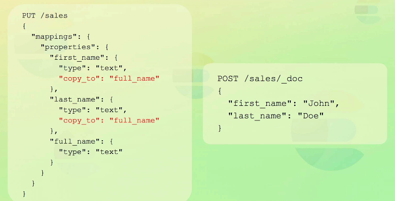

# Mapping and Analysis

## Analysis

    Permite que processemos os textos de forma eficiente

### Analyzer

Uma pipeline de processamento de texto, composta por 3 partes:

    Filtro de caracteres -> Adiciona, remove, altera caracteres

    Tokenizer -> apenas um por analyzer, o tokenizer divide a string em tokens

    Filtro de tokens -> consegue adicionar, remover ou alterar tokens 

### API

```Typescript
POST /_analyze
{
"text": "2 guys walk into  a bar, but the third... DUCKS! :-)",
"analyzer": "standard"
}
```

```Typescript
POST /_analyze
{
"text": "2 guys walk into  a bar, but the third... DUCKS! :-)",
"char_filter": [],
"analyzer": "standard",
"filter": ["lowercase"]
}
```

## Mapping

    Basicamente, definimos um schema para nossa base de dados não relacional. Não é necessário explicitar os metadados no mapping para que eles sejam indexados, pois se um metadado não existir, o elasticsearch cria um na hora.

### Coerção

    Quando indexando dados, se você fizer o schema com um tipo de dados e alimentar uma string ao invés de um float, o elasticsearch converte a string pra float (se possível).

    Alguns problemas surgem:

    O valor indexado não é o mesmo que o valor no _source, esse valor é o primeiro valor fornecido, então se vocÊ fornecer o primeiro valor errado, o dado no _source fica de tipo errado. A indexação tem os tipos corretos, o problema é o _source, ou seja, se você for pegar esse dado para trabalhar depois.

    Em resumo, a busca pelos dados não é prejudicada, mas o uso dos dados posteriormente. 

    Se você usar mapeamento dinâmico (ou seja, não fornecer schema e ir adicionando metadados), coerção não funciona.

    Se você não quiser problemas, garanta que está fornecendo os tipos corretos.

## Mapping - Mapeamento explícito

```Typescript
PUT /nome_indice
{
    "mappings": {
        "properties": {
            "rating": {
                "type": "float"
            },
            "content": {
                "type": "text"
            },
            "product_id": {
                "type": "integer"
            },
            "author": { // Isso é um objeto não nested
                "properties":{
                    "firts_name": {"type": "text"},
                    "last_name": {"type": "text"},
                    "email": {"type": "keyword"}
                }
            }
        }
    }
}
```

Para saber qual é o mapeamento sendo usado, podemos fazer:

```Typescript
GET /nome_indice/_mapping

// Podemos pegar mais coisas também, adicionando o item de interesse no cabeçalho de requisição
```

## Mapping - Tipos de Dados

### Keywords

Para match exato, serve para texto que não muda e está estruturado, por exemplo, e-mails. É analizado com o keyword analyzer, que literalmente não mexe na string.

### Arrays

Não tem mapeamento, todo metadado no elasticsearch pode receber 0 ou mais itens, simplesmente entregue para ele um array a ser indexado.

A exigência é que os tipos de dados sejam iguais. A menos que a coerção de dados dos dados de tipo "errado" sejam possíveis.

Elasticsearch achata arrays, então algo como

```Typescript
[0, 1, [2, 3], 5] 

// Vira

[0, 1, 2, 3, 5]
```

Se você quiser que a estrutura se mantenha, vai precisar usar o parâmetro nested.

### Dates

    Podemos ter datas sem tempo, com tempo, e em milissegundos desde a epoch (long) 

    O importante é não usar tempos em Unix, pois os milissegundos são diferentes, se for usar, multiplique por 1000

## Adicionar metadados ao mapeamento já existente

```Typescript
PUT /reviews/_mapping
{
    "properties":{
        "created_at": {
            "type": "data"
        }
    }
}
```

## Tipos de parâmetros para mapeamento

### Format

    Serve para formatar datas, a recomendação é usar a padrão se possível

### Properties

    Define campos aninhados para objetos e objetos aninhados (nested)


```Typescript
PUT /sales
{
    "mappings": {
        "properties": {
            "sold_by": {
                "properties": {
                    "name": {
                        "type": "text"
                    }
                }
            }
        }
    }
}

PUT /sales
{
    "mappings": {
        "properties": {
            "products": {
                "type": "nested",
                "properties": {
                    "name": {
                        "type": "text"
                    }
                }
            }
        }
    }
}
```

### Coerce (coerção)

Usado para ativar e desativar a coerção de tipo

```Typescript
{
    "settings": {
        "index.mapping.coerce" = false // coerção desativada globalmente
    },
    "mappings": {
        "properties": {
            "amount": {
                "type": float,
                "coerce": true // coerção ativada especificamente para esse metadado
            }
        }
    }
}
```


### doc_values

    Outra estrutura de dados usada pelo elasticsearch. Ela funciona de forma invertida, ao invés de fazer:

    termos -> pego -> documentos

    Ela faz:

    Documentos -> pego -> termos

    Ela é usada para agregations, filters e scripitings.

    O importante é que é possível desativar ela, apenas para salvar espaço em disco.

    Mas isso precisa ser muito planejado, pois é um campo que só pode ser alterado com re-indexação completa.

### norms

    Usado para busca e rankeamento, também pode ser desativado para preservar espaço em disco, mas é necessário pensar bastante antes de fazer isso.

### index

    Permite desativar a indexação de um campo, mas o campo ainda é salvo no _source, ele só não será usado para busca.

### copy_to

    Serve para copiar valores de um campo para outro, geralmente um agregador, exemplo:



## Reindexação 

```Typescript
POST /_reindex
{
    "source": {
        "index": "index_original" // Esse é o index com o mapeamento original
    },
    "dest": {
        "index": "index_final" // Esse é o index com o novo mapeamento
    }
}
```
## Index Templates

    Index templates nos permitem indexar um documento em um índice específico de forma automática, para isso, o nome do arquivo deverá seguir um padrão
```Typescript

```